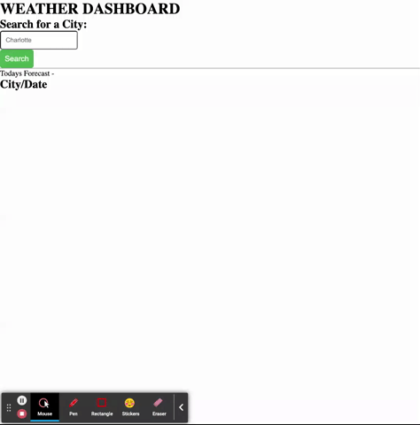

# Weather-Dashboard
## Description

In this project, I want to build a weather dashboard that will run in the browser and feature dynamically updated HTML and CSS.

## Motivation
- My motivation for this project was to test my knowledge on using localStorage to store any persistent data. In addition, I wanted to use the server side Web APIs to make the 5 day forecast operational. 

## Usage

## How to Contribute

Let me know what I could improve on!